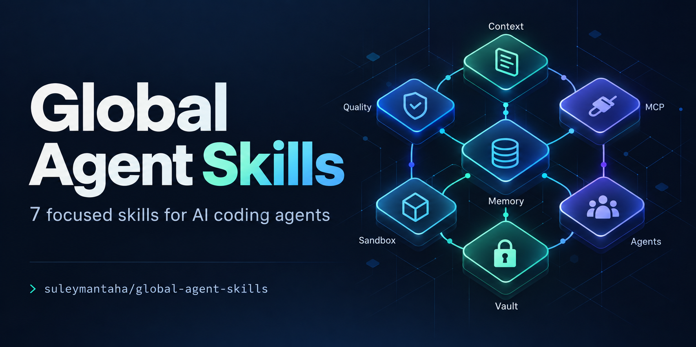

# Global Agent Skills



[](https://github.com/suleymantaha/global-agent-skills/actions/workflows/validate.yml)
[](LICENSE)

**An early, experimental collection of agent workflow guidance — use selectively, when it addresses an observed problem.**

## Should you use this collection?

These modules package general architectural guidance into skill instructions. They are optional references, not an essential upgrade for every coding agent. An already-capable agent may handle the same task equally well without reading them.

Our [single matched-control evaluation](evaluations/2026-10-01/RESULTS.md) found near-equal results: the control fully met 34/35 criteria plus one partial; the skill arm fully met 35/35. The skill arm took 85 seconds versus 77 and produced 2,749 report tokens versus 2,583. **This run did not establish a meaningful general advantage, speed improvement, or token savings.** One run cannot establish universal usefulness or uselessness.

### Recommended approach

1. Start from a concrete recurring problem in your real project, such as lost decisions, repeated command mistakes, or conflicting edits.
2. Check whether existing host features and repository instructions already solve it. Skip these modules if they add no useful information.
3. Select only the relevant skill and adapt it to verified project commands, constraints, and evidence. Keep project-specific guidance local.
4. Compare actual outcomes with and without the guidance over repeated tasks. Retain what helps; simplify or remove what does not.
5. Build persistent memory, retrieval, sandboxing, or orchestration infrastructure only when the task actually needs it. Writing a SKILL.md about a mechanism does not implement that mechanism.

### Where we are stopping

The collection, examples, and measured results remain public for inspection and reuse. We are not expanding it into a full agent platform merely to complete an architecture checklist. Further development should be driven by demonstrated failures and measured benefits, not the effort already invested. No broad community adoption or production-readiness claim is made.

The underlying architecture ideas may be useful in the right system. Our evaluation tests instruction bodies on small tasks; it does not evaluate a deployed memory, retrieval, or sandbox architecture.


If preserving handoff details is an observed problem, consider `context-optimization`. If project checks are repeatedly missed, consider `self-healing-quality-gates`. Evaluate the difference on your own tasks before adopting either broadly.

## Quickstart: your first skill

1. Clone this repo: `git clone https://github.com/suleymantaha/global-agent-skills.git`.
2. Read `context-optimization/SKILL.md`, then copy that folder directly into your Codex skills directory (`$CODEX_HOME/skills`, default `~/.codex/skills`). See the [OS-specific installation instructions](#installation) below.
3. In your next turn, ask:

```text
Use $context-optimization to prepare a handoff for my current task.
Preserve the objective, permissions, changed files, actual checks, unresolved
issues, evidence pointers, and the next action. Verify the repository state.
```

**See a real result:** [the launch-preparation handoff](examples/context-handoff/README.md) includes the actual request, captured command output, and agent-produced handoff. It is one maintainer-run example. A later [independent-context evaluation of all seven modules](evaluations/2026-10-01/RESULTS.md) includes matched control outputs, blinded review, timing, and output-token counts; it did not establish speed or token savings.

[Browse all seven skills](#skill-guide) · [Installation](#installation) · [Releases](https://github.com/suleymantaha/global-agent-skills/releases)

Seven focused, reusable instruction modules for AI agents, organized according to the [Agent Skills specification](https://agentskills.io/specification).

Use them to coordinate authorized workers, preserve context, design memory and isolation boundaries, run appropriate quality checks, integrate MCP tools, and capture knowledge. Install only the modules useful to your workflow.

## Contents

- [How skills work](#how-skills-work)
- [Repository layout](#repository-layout)
- [Skill guide](#skill-guide)
- [Installation](#installation)
- [Usage examples](#usage-examples)
- [Combining skills](#combining-skills)
- [Updating and uninstalling](#updating-and-uninstalling)
- [Validation and limitations](#validation-and-limitations)
- [Troubleshooting](#troubleshooting)
- [Contributing](#contributing)

## How skills work

A skill is a folder with a `SKILL.md` entry point. Its YAML frontmatter declares its name and description; its Markdown body gives the agent task-specific guidance.

```yaml
---
name: context-optimization
description: Use when oversized tool outputs, long sessions, or handoffs require reducing context while preserving task state and decisive evidence.
metadata:
  version: "1.1.0"
---
```

In a compatible host, names and descriptions support discovery. The full instructions are loaded when the skill applies; supporting resources can be read only when needed. This is progressive disclosure: installing seven skills does not mean every task needs all seven bodies.

In Codex, request a skill explicitly with `$skill-name`. Automatic selection can also consider its description when it matches the task. Selection does not guarantee that every installed skill will run. Host instructions, available tools, user permissions, and repository conventions remain authoritative.

These files provide guidance. They do **not** install memory databases, sandbox runtimes, MCP servers, hooks, schedulers, or background agents. They do not add permissions or tools to the host.

## Repository layout

```text
global-agent-skills/
├── README.md                         # This usage and installation guide
├── CONTRIBUTING.md                   # Contribution and evaluation guidance
├── LICENSE                           # Apache-2.0 license
├── .gitignore                        # Excludes secrets, caches, local environments
├── .gitattributes                     # Normalizes text line endings to LF
├── requirements-dev.txt              # Validator dependency; not a runtime requirement
├── assets/
│   └── cover.png                      # Generated project cover
├── evaluations/
│   └── 2026-10-01/                    # Protocol, fixtures, outputs, review and measured results
├── examples/
│   └── context-handoff/               # Actual request, evidence, output and limits
├── docs/
│   └── release-v0.1.0.md              # First collection release notes
├── .github/
│   └── workflows/
│       └── validate.yml              # Checks pushed commits and pull requests
├── scripts/
│   └── validate_skills.py            # Frontmatter and local-link validation
├── agent-memory-systems/
│   └── SKILL.md
├── code-sandbox-security/
│   └── SKILL.md
├── context-optimization/
│   └── SKILL.md
├── mcp-tool-integration/
│   └── SKILL.md
├── multi-agent-orchestrator/
│   └── SKILL.md
├── second-brain-vault/
│   └── SKILL.md
└── self-healing-quality-gates/
    └── SKILL.md
```

Every module is currently self-contained. There are no per-skill scripts or assets to install. The top-level `scripts/` directory is repository maintenance tooling, not an agent skill.

For future additions, a module may include `references/` for conditional guidance, `scripts/` for tested helpers, `assets/` for output templates, or `agents/openai.yaml` for Codex-specific metadata. Add these only when they have a concrete purpose and link relevant resources from `SKILL.md`.

## Skill guide

| Skill | Useful for | Guidance it adds |
| --- | --- | --- |
| [multi-agent-orchestrator](multi-agent-orchestrator/SKILL.md) | Explicitly requested or otherwise authorized delegation | Independent task scopes, file ownership, shared-filesystem checks, integration evidence |
| [code-sandbox-security](code-sandbox-security/SKILL.md) | Designing/reviewing untrusted-code execution | Threat-based isolation choice, resource limits, egress and credential boundaries, denied-access tests |
| [context-optimization](context-optimization/SKILL.md) | Large outputs, long sessions, handoffs | Targeted retrieval, summaries that retain permissions and failures, evidence pointers |
| [agent-memory-systems](agent-memory-systems/SKILL.md) | Persistent memory implementation/review | Scoped access, provenance, temporal facts, deletion, idempotency and outage handling |
| [self-healing-quality-gates](self-healing-quality-gates/SKILL.md) | Selecting checks and repairing failures | Existing project tooling, minimal repairs, bounded retries, actual test evidence |
| [mcp-tool-integration](mcp-tool-integration/SKILL.md) | MCP discovery, setup and troubleshooting | Existing-tool discovery, official-source verification, least privilege, operational checks |
| [second-brain-vault](second-brain-vault/SKILL.md) | Markdown/Obsidian knowledge workflows | User-selected vaults, narrow edits, duplicate prevention, reusable skill candidates |

You do not need Mem0, Graphiti, Letta, Docker, Kubernetes, or an MCP server merely to install this collection. Individual implementation tasks may need those services; the agent should check actual requirements first.

## Installation

### 1. Get the repository

```sh
git clone https://github.com/suleymantaha/global-agent-skills.git
cd global-agent-skills
```

Read the selected `SKILL.md` files before installing. Git is needed for cloning; downloading a ZIP and extracting the same folders is an alternative. Python is only needed for the optional repository validator.

### 2. Copy selected folders into Codex's skills directory

Use `$CODEX_HOME/skills` when `CODEX_HOME` is configured; otherwise use `~/.codex/skills`. Each skill folder must be directly inside that directory:

```text
~/.codex/skills/
├── context-optimization/
│   └── SKILL.md
└── self-healing-quality-gates/
    └── SKILL.md
```

Do not place the entire repository inside one skill folder. Do not copy `README.md`, `.git`, or repository CI files into the discovery directory.

#### Windows / PowerShell

Run from the cloned repository. This example installs one module and stops if it already exists:

```powershell
$skillName = 'context-optimization'
$skillRoot = if ($env:CODEX_HOME) {
    Join-Path $env:CODEX_HOME 'skills'
} else {
    Join-Path $env:USERPROFILE '.codex/skills'
}
$skillTarget = Join-Path $skillRoot $skillName
if (Test-Path -LiteralPath $skillTarget) {
    throw "Already installed: $skillTarget. Review differences before updating."
}
New-Item -ItemType Directory -Force -Path $skillRoot | Out-Null
Copy-Item -LiteralPath (Join-Path (Get-Location).Path $skillName) -Destination $skillTarget -Recurse
```

#### macOS / Linux

Run from the cloned repository. This example also stops if the target exists:

```sh
skill_name=context-optimization
skill_root="${CODEX_HOME:-$HOME/.codex}/skills"
skill_target="$skill_root/$skill_name"
if [ -e "$skill_target" ]; then
  echo "Already installed: $skill_target. Review differences before updating."
else
  mkdir -p "$skill_root"
  cp -R "./$skill_name" "$skill_target"
fi
```

Repeat with any of the seven folder names. Installing one module does not require installing the others. A user-level installation makes the module available across that user's Codex projects; it does not install it for every operating-system user or remote host.

### 3. Use it in Codex

Installed skills become available on the next turn. Start with an explicit invocation and a concrete task:

```text
Use $context-optimization to prepare a handoff for this task.
Preserve the objective, constraints, changed files, failed checks, and next action.
```

If discovery fails, check the path and frontmatter, then refresh or reopen the session. Other Agent Skills-compatible hosts may use different installation paths and invocation syntax; follow the host's own documentation.

## Usage examples

Provide the actual task, permitted scope, and expected result. These examples are requests to an agent, not shell commands; Turkish requests work too.

### Coordinate workers

```text
Use $multi-agent-orchestrator to review the frontend and backend in parallel.
Read-only review only. Assign independent scopes, avoid overlapping writes,
and return one report with evidence. If delegation is unavailable, work sequentially.
```

Expected result: scoped worker assignments or sequential fallback, consolidated findings, and verification evidence. The skill cannot override host restrictions on spawning agents.

### Review a sandbox design

```text
Use $code-sandbox-security to review our proposed untrusted Python runner.
The deployment target is Linux with containers. Assess filesystem, network,
credential, tenant, and resource boundaries. Produce a review; do not deploy.
```

Expected result: an evidence-based boundary review and a verification plan. Runtime isolation requires an actual supported sandbox.

### Prepare a handoff

```text
$context-optimization kullanarak bu görevin devam özetini hazırla.
Son kullanıcı kararlarını, değişen dosyaları, test sonuçlarını ve açık işleri koru.
```

Expected result: a concise state summary with exact evidence pointers rather than raw log dumps.

### Design memory

```text
Use $agent-memory-systems to design persistent memory for our existing agent.
Keep tenants isolated and support correction, expiry, and deletion.
Compare approaches before proposing dependencies; do not export conversation data.
```

Expected result: a scoped storage/retrieval design and meaningful acceptance tests. Backend availability and persistence must be verified separately.

### Repair quality-check failures

```text
$self-healing-quality-gates kullanarak bu değişikliğin gerekli kontrollerini çalıştır.
Repo convention'larını kullan, ilgili hataları kapsam içinde düzelt ve gerçek
komutlarla sonuçları raporla. Testleri geçsin diye zayıflatma.
```

Expected result: project-specific checks, minimal repairs, bounded retries, and a clear account of passed, failed, or unavailable verification.

### Investigate MCP access

```text
Use $mcp-tool-integration to determine whether the current host already provides
GitHub read access. Verify a harmless read. If integration is missing, propose
concrete configuration without installing or connecting new services.
```

Expected result: verified existing capabilities or a reviewable setup proposal with required scopes.

### Capture vault knowledge

```text
Use $second-brain-vault to record this task's verified decisions in the vault
at <my-vault-path>. Follow its existing journal conventions, preserve previous
entries, and omit secrets. Do not register automatic hooks.
```

Expected result: a targeted, duplicate-aware note update in the specified vault. Replace the placeholder with your actual authorized destination.

## Combining skills

Use multiple modules when a task actually crosses their boundaries. For example:

```text
Use $multi-agent-orchestrator for two independent implementation tasks,
then $self-healing-quality-gates to verify the combined result.
Finish with $context-optimization to prepare a continuation summary.
```

The coordinator still owns integration. Requesting multiple skills does not grant extra permissions, create isolation automatically, or require a fixed hierarchy. For a simple change, one appropriate skill may be enough.

## Updating and uninstalling

Repository updates do not automatically update installed copies.

1. Run `git pull --ff-only` inside the clone.
2. Compare the selected repository module with its installed copy.
3. Back up any locally edited installed module outside the active skill discovery directory.
4. Replace only the intended module after reviewing the changes.
5. Run repository validation and use a new turn to check discovery.

To uninstall, remove or move only the selected module folder from the host's skill discovery directory. Preserve personal edits first. This does not uninstall services previously created during a separate implementation task.

## Validation and limitations

For repository maintainers, use Python 3.10+ with an isolated environment:

```sh
python -m venv .venv
```

Activate with `.venv/Scripts/Activate.ps1` in PowerShell or `source .venv/bin/activate` on macOS/Linux, then run:

```sh
python -m pip install -r requirements-dev.txt
python scripts/validate_skills.py
```

The validator checks that skills exist, frontmatter is parseable, names match folders, descriptions have valid lengths, metadata maps strings to strings, instructions are nonempty, and repository-local Markdown file links resolve. It does not validate anchor existence, external URLs, or every optional Agent Skills field constraint. GitHub Actions runs this same validator on pushes and pull requests.

Format and local-link checks have passed. Initial validator checks also exercised rejection of invalid names, non-string metadata, and missing local files. These are structural checks. A [maintainer-run context handoff](examples/context-handoff/README.md) demonstrates one real use; an [independent-context matched-control evaluation](evaluations/2026-10-01/RESULTS.md) now covers all seven modules with one case each. Repeated-run, cross-host, and production behavioral evaluation remains open. No security, cost-saving, or isolation guarantee follows from a green CI run.

## Troubleshooting

| Symptom | What to check |
| --- | --- |
| Skill is not discovered | Correct host/user, CODEX_HOME override, direct folder placement, valid SKILL.md |
| Installed skill seems outdated | Clone and installed copy are separate; compare and update the selected module |
| Agent does not select a module | Task may not match its description; try explicit `$skill-name` invocation |
| Delegation tool is unavailable | Host capabilities and restrictions apply; use sequential fallback |
| No memory or sandbox service appears | Installation adds instructions only; infrastructure is a separate task |
| MCP setup exists but calls fail | Verify runtime connection, authentication, scopes, and a harmless read |
| Validator cannot import yaml | Activate the environment and install requirements-dev.txt |
| Another agent host ignores the folder | Use that host's documented discovery path and invocation syntax |

## Contributing

See [CONTRIBUTING.md](CONTRIBUTING.md). Useful contributions include realistic evaluation scenarios, observed failures, narrow instruction improvements, and tested helpers. Include the host and tool context, remove private data, and distinguish what you observed from what you expect.

## License

[Apache License 2.0](LICENSE).
